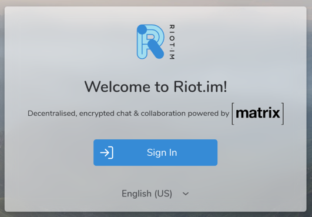
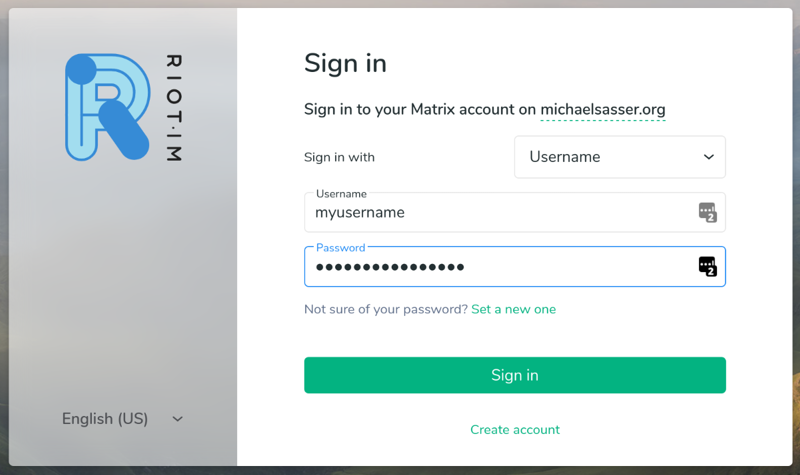
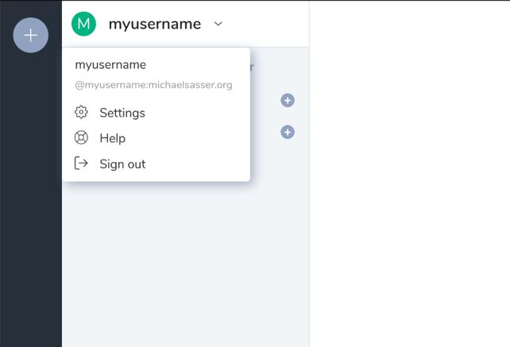
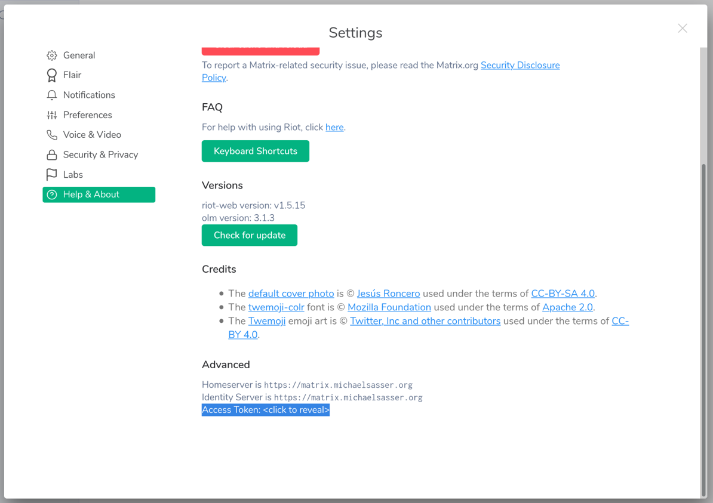
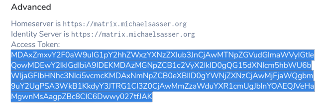

Access Token
************

To use the API of Synapse you need a access token of an administrator.
To get an access token, you need an user account.
MatrixCtl helps you to register one. Just run:

.. code-block:: console

  $ matrixctl adduser --ansible --admin myusername
  Password:
  Password (again):
  Username: myusername
  Password: **HIDDEN**
  Admin:    yes
  Is everything ok? [y/n]y

  PLAY [Set up a Matrix server] *********************************************************************************

  [...]

  PLAY RECAP ****************************************************************************************************
  matrix.michaelsasser.org   : ok=24   changed=0    unreachable=0    failed=0    skipped=34   rescued=0    ignored=0

.. note:: If you don't enter a password and press [ENTER] twice, a password
           will be generated for you. If you are satisfied with it, enter [y].

Now you have created your user with the user name "myusername". The argument
``--admin`` makes sure, that you create an administrator account instead of an
user account. The ``--ansible`` argument is needed, because you currently have
no access to the admin API. After all that steps you don't need the
``--ansible`` anymore.

.. note:: You can use this user account as your personal main user account.

.. note:: If you have already created an admin user account ignore this step
          and continue below.

Now Open ``https://element.yourdomain.tld`` to login.

    The Element loginscreen

Click on "Sign In" and enter your credentials. In this example, we used
"myusername" for the user and the entered password to login.

    Entering credentials

After you are logged in, click on your user name in the top right corner. A
small window will pop up. Click on ``Settings``.

    Click on "Settings"

A bigger window with your user settings will pop up. Click on ``Help & About``
on the left side of that window. If you scroll down on the right
hand side of this window, you will find the ``Advanced`` section.
In the Advanced section you find ``Access Token: <click to reveal>``.

    Click on "<click to reveal>"

Now click on ``<click to reveal>``.

    The revealed access token

This is your access token. It is already highlighted for you. Just copy it into
the config file into the ``api`` section.

Copy The Token
--------------

Now you can copy the token into the ``api`` section of your config file.
If you don't have a config file head over to the :ref:`Config File` chapter.

.. code-block:: yaml

   ...
   api.
     domain: yourdomain.tld
     token: MDAxZmxvY2F0aW9uIG1pY2hhZWxzYXNzZXIub3JnCjAwMTNpZGVudGlmaWVyIGtleQowMDEwY2lkIGdlbiA9IDEKMDAzMGNpZCB1c2VyX2lkID0gQG15dXNlcm5hbWU6bWljaGFlbHNhc3Nlci5vcmcKMDAxNmNpZCB0eXBlID0gYWNjZXNzCjAwMjFjaWQgbm9uY2UgPSA3WkB1KkdyY3JTRG1CI3Z0CjAwMmZzaWduYXR1cmUgJblnYOAEQJVeHaMgwnMsAagpZBc8CIC6Dwwy027tfJAK
   ...

.. note:: To be able to use the admin API, you need to have
          ``matrix_static_files_container_labels_base_domain_enabled: true``
          and
          ``matrix_synapse_container_labels_public_client_synapse_admin_api_enabled: true``
          in your ``vars.yml file. This will stop the playbook from setting
          up a redirect ``matrix.yourdomain.tld`` to
          ``element.yourdomain.tld``

.. warning:: Never ever, ever give this token to anyone else. If you have other
             administrators on that server, they should use their own token.
             With this token you can login and do anything on that matrix
             instance in **your name**.
